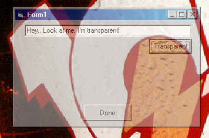



## Transparent Form

### Description

Demostrate how to create a transparent form using VisualBasic. This code will run only on a Windows 2000 machine due to the fact that the SetLayeredWindowAttributes API is unsupported under Windows 95/98/NT.
 
### More Info
 
No Inputs

This code assumes you are running Windows 2000.

No Returns

No known side effects

             |
---                |---
**Submitted On**   |2000-08-31 13:03:30
**By**             |[William Phyer](https://github.com/Planet-Source-Code/PSCIndex/blob/master/ByAuthor/william-phyer.md)
**Level**          |Intermediate
**User Rating**    |4.8 (19 globes from 4 users)
**Compatibility**  |VB 5\.0, VB 6\.0
**Category**       |[Miscellaneous](https://github.com/Planet-Source-Code/PSCIndex/blob/master/ByCategory/miscellaneous__1-1.md)
**World**          |[Visual Basic](https://github.com/Planet-Source-Code/PSCIndex/blob/master/ByWorld/visual-basic.md)
**Archive File**   |[CODE\_UPLOAD94738312000\.zip](https://github.com/Planet-Source-Code/william-phyer-transparent-form__1-11136/archive/master.zip)

